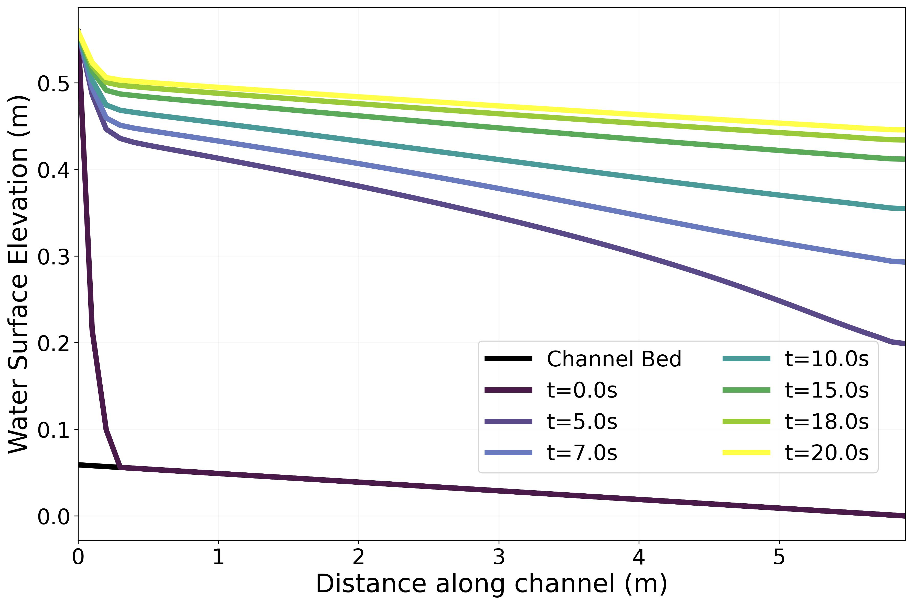

# Summary

RiverFlowDynamics enables researchers to simulate how water flows through rivers, streams, and flood plains using realistic physics, making it valuable for flood risk assessment, environmental studies, and water resource management. This paper introduces the novel two-dimensional flow model developed as a component of the Landlab Python Package [@hobley:2017;@barnhart:2020;@Hutton:2020;@Hutton:2020], designed to simulate river and stream behavior under various flow conditions over natural and artificial topography. RiverFlowDynamics is founded on the depth-averaged Saint-Venant equations, also known as the shallow water equations [@casulli1990semi;@casulli_semi-implicit_1999], which capture essential free-surface flow dynamics by assuming vertical accelerations are negligible compared to horizontal ones. For numerical solution, the component employs the finite volume method chosen for its robustness, capacity to handle complex geometries, and inherent conservation properties [@andersson2011computational;@fletcher2012computational], with the model's structure allowing for easy parallelization to enable simulations of extensive river networks or large coastal areas.

A key feature of the model is its semi-implicit and semi-Lagrangian representation that treats water surface elevation and velocity implicitly while handling advective terms explicitly, allowing for larger time steps and enhanced computational efficiency [@robert1985semi;@robert_stable_1981]. The semi-Lagrangian advection scheme tracks fluid particles backwards using Pollock's semi-analytical method [@pollock1988semianalytical], which assumes linear velocity variation within each grid cell and relaxes the Courant-Friedrichs-Lewy condition [@staniforth1991semi;@bates1982multiply]. Source terms account for bottom friction using the Manning-Chezy formula [@he2017numerical;@brufau2000two], while the model features robust dry/wet cell transitions using the method of @casulli1992semi and implements Dirichlet conditions for inlet boundaries and gradient-based or radiation-based conditions for open boundaries. The model has been validated through comprehensive testing including analytical solutions, numerical stability tests, sensitivity analyses, mass conservation checks, and boundary condition validations.

RiverFlowDynamics offers advantages over simpler overland flow models available in Landlab [@adams2017landlab;@de2012improving] by solving the complete depth-averaged Saint-Venant equations rather than simplified approximations like the kinematic wave equation. This enables comprehensive representation of complex flow dynamics including subcritical and supercritical flows, hydraulic jumps, and channel-floodplain interactions, making it superior for rapid flood propagation, detailed floodplain mapping, and complex river morphodynamics analysis. The semi-Lagrangian scheme provides enhanced stability for advection-dominated flows, particularly valuable for high-velocity currents or steep terrain applications. Source code is available as part of the Landlab Python package (v2.7.0 and later) with tutorials in the main documentation repository.

# Statement of need

RiverFlowDynamics is a Python-based 2D flow model developed as a component of the Landlab framework, addressing a critical gap in modeling complex river systems and flood dynamics. Prior to RiverFlowDynamics, Landlab lacked a comprehensive 2D flow model capable of handling fully advective-dominated problems, particularly in rivers with complex topographies, hindering accurate simulations of diverse flow regimes crucial for advanced hydrological and environmental studies. The model's integration into Landlab's component framework enables future coupling with sediment transport components to simulate morphodynamic processes and assess impacts on aquatic habitat and riverine vegetation dynamics under changing flow conditions.

Compared to existing hydraulic modeling software such as TELEMAC and Delft3D, RiverFlowDynamics offers unique advantages through its native Python implementation and integration with the Landlab framework, providing enhanced interoperability with other Earth surface process models and the broader scientific Python ecosystem while maintaining comparable numerical accuracy. The model solves complete depth-averaged Saint-Venant equations, enabling capture of complex flow dynamics including subcritical and supercritical flows, hydraulic jumps, and channel-floodplain interactions, making it valuable for applications from small-scale stream dynamics to large-scale flood simulations, rapid flood propagation in urban areas, detailed floodplain mapping, and complex river morphodynamics analysis in mountainous regions. Integration with Landlab leverages its established grid structure, visualization tools, and interoperability with other components, facilitating multi-process simulations and reducing development overhead.


## Basic Usage Example

RiverFlowDynamics integrates with Landlab's grid structure. A simple example demonstrates water flow in a rectangular channel:

```python
import numpy as np
from landlab import RasterModelGrid
from landlab.components import RiverFlowDynamics

# Create grid/topography
grid = RasterModelGrid((20, 60), xy_spacing=0.1)
z = grid.add_zeros("topographic__elevation", at="node")
z += 0.059 - 0.01 * grid.x_of_node
z[(grid.y_of_node > 1.5) | (grid.y_of_node < 0.5)] = 1.0

# Initialize_Fields
grid.add_zeros("surface_water__depth", at="node")
grid.add_zeros("surface_water__velocity", at="link")
wse = grid.add_zeros("surface_water__elevation", at="node")
wse += z

# Boundary_Conditions
fixed_entry_nodes = np.arange(300, 910, 60)
fixed_entry_links = grid.links_at_node[fixed_entry_nodes][:, 0]

# Run_Model
rfd = RiverFlowDynamics(
    grid,
    fixed_entry_nodes=fixed_entry_nodes,
    fixed_entry_links=fixed_entry_links,
    entry_nodes_h_values=np.full(11, 0.5),
    entry_links_vel_values=np.full(11, 0.45),
)

for _ in range(100):
    rfd.run_one_step()
```	


# Acknowledgements
This research was supported by NSF EPSCoR (Award #2242769) and Chile's ANID FONDECYT Iniciación (Grant #11200949 to AM). Landlab development was funded by NSF (Awards #1147454, #1148305, #1450409, #1450338, #1450412) and the Community Surface Dynamics Modeling System (NSF Awards #1226297, #1831623).

# References
